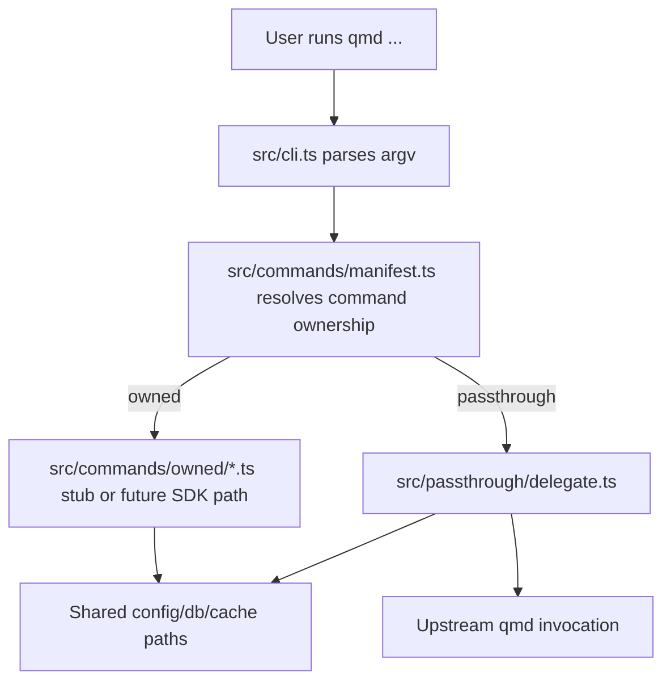

# feat: Scaffold K-QMD replacement distribution

## Enhancement Summary

**Deepened on:** 2026-03-11
**Sections enhanced:** 7
**Research inputs:** `framework-docs-researcher`, `best-practices-researcher`, `architecture-strategist`, `kieran-typescript-reviewer`, `security-sentinel`, `performance-oracle`, `code-simplicity-reviewer`, `pattern-recognition-specialist`, official npm/Node.js/TypeScript/Vitest/Biome documentation

### Key Improvements

1. `qmd` 배포 계약을 `package.json#bin`, shebang entrypoint, emitted build output까지 포함하는 형태로 구체화했다.
2. `Biome + Vitest + tsc` 선택을 단순 도구 목록이 아니라 실제 스크립트, 설정 파일, CI 가능한 quality gate로 구체화했다.
3. argv parsing, passthrough delegation, integration test 전략에 공식 Node.js 근거를 연결해 wrapper 경계의 보안성과 parity 요구사항을 강화했다.

### New Considerations Discovered

- npm의 `bin` 필드는 실제 실행 파일을 PATH에 연결하므로, TypeScript 소스만 두는 것으로는 충분하지 않다. shebang이 있는 executable entrypoint와 build output 계약이 필요하다.
- `biome check`는 포맷/린트/정리 검증을 한 번에 수행할 수 있지만, CI와 로컬 검증에서는 read-only로 유지하는 편이 안전하다. 파일 수정은 `format` 또는 별도 fix 명령에 남기는 것이 낫다.
- passthrough delegation은 `child_process.spawn` 기반으로 argv 배열을 그대로 넘기고 `shell: false`, `stdio: 'inherit'`를 유지하는 쪽이 CLI parity와 보안 측면에서 유리하다.

## Overview

K-QMD의 첫 스프린트 목표는 한국어 검색 품질 자체를 구현하는 것이 아니라, 이후 스프린트에서 안전하게 실험할 수 있는 `qmd-compatible replacement distribution`의 뼈대를 세우는 것이다. 사용자는 `kqmd`를 설치하지만 실제 호출 명령은 계속 `qmd`여야 하며, 초기 저장소는 단일 TypeScript 패키지와 CLI 라우팅 경계부터 시작한다 (see brainstorm: `docs/brainstorms/2026-03-11-kqmd-brainstorm.md`).

이번 계획은 브레인스토밍에서 선택한 `Approach A`를 그대로 따른다. 즉, K-QMD를 별도 병렬 CLI로 내놓지 않고 replacement distribution으로 정의하며, 한국어 지원 핵심 seam인 `search`, `query`, `update`, `embed`만 owned surface로 준비하고 나머지는 upstream 동작으로 위임한다 (see brainstorm: `docs/brainstorms/2026-03-11-kqmd-brainstorm.md`).

## Problem Statement / Motivation

- upstream `qmd`는 검색 도구로 강력하지만 한국어 full-text 동작은 아직 약하다 (see brainstorm: `docs/brainstorms/2026-03-11-kqmd-brainstorm.md`).
- upstream 내부에 직접 큰 PR을 넣거나 무거운 fork를 유지하는 접근은 maintainer 리스크와 실험 속도 측면에서 불리하다. 그래서 invasive upstream 변경보다 별도 배포판으로 먼저 검증한다 (see brainstorm: `docs/brainstorms/2026-03-11-kqmd-brainstorm.md`).
- 현재 저장소에는 브레인스토밍 문서 외에 구현 코드, README, 패키지 매니페스트, 학습 문서가 없다. 즉, 다음 스프린트의 기능 개발 전에 CLI 표면, 라우팅 정책, 호환성 경계를 고정하는 스캐폴딩이 선행되어야 한다.

## Chosen Approach

### Adopted: Approach A

`kqmd`를 패키지 정체성으로 배포하되 사용자 경험은 계속 `qmd`로 유지한다. owned command는 wrapper가 직접 가로채고, 저위험 명령은 passthrough로 남긴다. 이 접근은 사용자 재교육 비용을 늘리지 않으면서 한국어 지원 개선을 upstream 릴리스 주기와 분리해서 반복할 수 있다 (see brainstorm: `docs/brainstorms/2026-03-11-kqmd-brainstorm.md`).

### Rejected Alternatives

- `Approach B: separate kqmd CLI`
  사용자가 새 명령을 배워야 해서 제품 가치가 약해진다. 브레인스토밍에서 명시한 "익숙한 `qmd` 경험 유지"와 충돌한다 (see brainstorm: `docs/brainstorms/2026-03-11-kqmd-brainstorm.md`).
- `Approach C: upstream-first invasive PR or fork`
  비관리자 입장에서 리뷰/유지보수 리스크가 크고, 실험 사이클이 느려진다. 스캐폴딩 단계에서 감수할 가치가 없다 (see brainstorm: `docs/brainstorms/2026-03-11-kqmd-brainstorm.md`).

## Scope For This Sprint

### In Scope

- 단일 TypeScript 패키지 저장소 초기화
- `package.json`에서 `qmd` 바이너리를 노출하는 CLI 엔트리포인트 스캐폴딩
- `search`, `query`, `update`, `embed`를 owned command로 선언하는 라우팅 매니페스트
- `collection`, `status`, `ls`, `get`, `multi-get`, `mcp`를 passthrough command로 선언하는 위임 경계
- upstream-compatible 설정/DB/캐시 경로를 해석하는 호환성 레이어
- owned command stub, passthrough delegate, unknown command 처리에 대한 테스트 뼈대
- replacement distribution 모델과 범위를 설명하는 README/architecture 문서
- upstream drift 추적 정책과 parity baseline 문서화

### Explicitly Out Of Scope

- 한국어 tokenization, 형태소 분석, 검색 ranking, 인덱싱 품질 개선 구현
- Qwen3 embeddings zero-config 기본값 적용
- `collection`의 owned behavior 전환
- 전체 CLI 재구현
- upstream 내부 코드 수정이나 대규모 fork 운영

## Repository Shape & Proposed Deliverables

브레인스토밍의 결정대로 저장소는 단일 TypeScript 패키지로 시작한다 (see brainstorm: `docs/brainstorms/2026-03-11-kqmd-brainstorm.md`). 스캐폴딩 완료 시 최소한 아래 구조가 존재해야 한다.

```text
package.json
tsconfig.json
tsconfig.build.json
.editorconfig
biome.json
vitest.config.ts
README.md
bin/qmd.js
src/cli.ts
src/commands/manifest.ts
src/commands/owned/search.ts
src/commands/owned/query.ts
src/commands/owned/update.ts
src/commands/owned/embed.ts
src/passthrough/delegate.ts
src/passthrough/upstream_locator.ts
src/config/qmd_paths.ts
src/types/command.ts
test/cli-routing.test.ts
test/passthrough-contract.test.ts
test/path-compatibility.test.ts
test/unknown-command.test.ts
docs/architecture/kqmd-command-boundary.md
docs/architecture/upstream-compatibility-policy.md
```

`dist/`는 publish/build 산출물로 생성하되 커밋 대상에는 포함하지 않는 것을 기본값으로 둔다. 스캐폴딩 문서에는 committed source와 generated artifact의 경계를 명시해야 한다.

### Research Insights

**Best Practices:**

- npm CLI 배포 계약은 `name: kqmd`와 `bin: { "qmd": "./bin/qmd.js" }`를 분리해 표현한다. 패키지 이름과 사용자 명령 이름을 다르게 가져가려는 브레인스토밍 결정을 가장 직접적으로 반영하는 형태다.
- `package.json#files` allowlist를 써서 publish surface를 `bin/`, `dist/`, `README.md`, `LICENSE` 정도로 제한하는 편이 안전하다.
- `tsconfig.json`은 editor/typecheck용 `noEmit: true` 구성으로 유지하고, 실제 publish 산출이 필요하면 `tsconfig.build.json`이 emit을 담당하는 분리 구성이 단순하다.

**Implementation Details:**

```json
{
  "name": "kqmd",
  "type": "module",
  "bin": {
    "qmd": "./bin/qmd.js"
  },
  "files": ["bin", "dist", "README.md", "LICENSE"],
  "scripts": {
    "build": "tsc -p tsconfig.build.json",
    "prepack": "npm run build",
    "lint": "biome check .",
    "format": "biome format --write .",
    "test": "vitest run",
    "test:watch": "vitest",
    "test:coverage": "vitest run --coverage",
    "typecheck": "tsc --noEmit",
    "check": "npm run lint && npm run typecheck && npm run test"
  }
}
```

**Edge Cases:**

- local install과 packed tarball install이 동일하게 `qmd`를 노출하는지 별도 smoke test가 필요하다
- shebang entrypoint 없이 `bin`을 TS 파일에 직접 연결하면 설치 후 실행 실패 가능성이 높다

## Developer Tooling Baseline

이번 스프린트는 실제 기능보다 scaffold quality bar를 정하는 것이 중요하므로, 개발 도구도 같이 고정한다.

- `Lint + format: Biome`
  greenfield 단일 TypeScript CLI에서는 ESLint + Prettier 이중 구성을 따로 두기보다 `biome.json` 하나로 정리하는 편이 설정 비용이 낮다. 이번 스프린트에서는 `biome check .`와 `biome format --write .`를 표준 명령으로 채택한다.
- `Testing: Vitest`
  `vitest.config.ts`를 두고 라우팅 계약, passthrough 위임, path compatibility, unknown command 처리를 검증한다. TypeScript 친화성과 빠른 실행 속도 덕분에 초기 CLI scaffold에 적합하다.
- `Type safety: TypeScript compiler`
  린트와 별도로 `tsc --noEmit`를 quality gate로 둔다. CLI 라우팅 테이블과 command 타입이 늘어날수록 정적 타입 검사가 drift를 빨리 잡아준다.
- `Script contract`
  `package.json`에는 최소한 `lint`, `format`, `test`, `test:watch`, `typecheck`, `check` 스크립트가 있어야 한다. `check`는 로컬과 CI에서 공통으로 쓰는 집계 명령으로 정의한다.

### Research Insights

**Best Practices:**

- `biome.json`에는 `$schema`, `vcs.enabled`, `vcs.useIgnoreFile`, `files.includes`를 명시해 편집기와 CLI 동작을 일치시킨다.
- `vitest.config.ts`는 `environment: "node"`를 기본으로 두고, CLI contract test는 `test/**/*.test.ts` 패턴으로 좁혀 둔다.
- `strict: true`와 `noEmit: true`를 `tsconfig.json`의 기본값으로 두고, publish build는 별도 build config에서만 emit하게 한다.

**Implementation Details:**

```json
{
  "$schema": "./node_modules/@biomejs/biome/configuration_schema.json",
  "vcs": {
    "enabled": true,
    "clientKind": "git",
    "useIgnoreFile": true
  },
  "files": {
    "includes": ["src/**/*.ts", "test/**/*.ts", "*.json", "*.md"]
  },
  "formatter": {
    "enabled": true,
    "indentStyle": "space",
    "indentWidth": 2
  },
  "linter": {
    "enabled": true,
    "rules": {
      "recommended": true
    }
  }
}
```

```ts
import { defineConfig } from 'vitest/config';

export default defineConfig({
  test: {
    environment: 'node',
    include: ['test/**/*.test.ts'],
    coverage: {
      provider: 'v8',
    },
  },
});
```

**Edge Cases:**

- `check` 스크립트가 write 동작을 포함하면 CI와 로컬 검증 결과가 달라질 수 있으므로 read-only 집계로 유지한다
- child process를 쓰는 CLI 테스트는 unit test와 분리해 실행 시간을 관리해야 한다

## Proposed Solution

스캐폴딩은 세 레이어로 분리한다.

1. `routing`
   `src/commands/manifest.ts`를 단일 source of truth로 두고, 각 명령이 `owned`, `passthrough`, `unsupported` 중 어디에 속하는지 선언한다.
2. `policy defaults`
   `src/config/qmd_paths.ts`에서 upstream `qmd`와 동일한 설정/DB/캐시 경로를 계산해 wrapper의 기본 동작을 고정한다 (see brainstorm: `docs/brainstorms/2026-03-11-kqmd-brainstorm.md`).
3. `execution`
   owned command는 일단 stub handler를 통해 미래 구현 seam만 만든다. passthrough command는 `src/passthrough/delegate.ts`가 위임 책임을 갖고, delegate target discovery는 `src/passthrough/upstream_locator.ts`로 격리한다.

이 분리는 브레인스토밍의 open question이었던 "routing, policy defaults, SDK calls, subprocess delegation 책임 분리"를 스캐폴딩 단계에서 선제적으로 정리하는 결정이다. SDK 호출과 실제 한국어 로직은 다음 스프린트의 owned command 구현으로 미룬다.

### Research Insights

**Best Practices:**

- top-level CLI는 wrapper가 직접 소유하는 최소 옵션만 파싱하고, command-specific argv는 owned handler 또는 passthrough delegate로 raw 형태에 가깝게 넘긴다.
- route manifest는 discriminated union으로 타입화해 `owned`와 `passthrough`가 코드에서 구분되도록 한다. 이 방식이 추후 command 증가 시 drift를 줄인다.
- passthrough delegate는 `spawn(command, args, { shell: false, stdio: 'inherit' })` 계열로 설계해 stdio parity와 exit code propagation을 유지한다.

**Implementation Details:**

```ts
export type CommandRoute =
  | { mode: 'owned'; command: 'search' | 'query' | 'update' | 'embed' }
  | { mode: 'passthrough'; command: string; upstreamCommand?: string };

export const commandManifest = {
  search: { mode: 'owned', command: 'search' },
  query: { mode: 'owned', command: 'query' },
  update: { mode: 'owned', command: 'update' },
  embed: { mode: 'owned', command: 'embed' },
  collection: { mode: 'passthrough', command: 'collection' },
  status: { mode: 'passthrough', command: 'status' },
  ls: { mode: 'passthrough', command: 'ls' },
  get: { mode: 'passthrough', command: 'get' },
  'multi-get': { mode: 'passthrough', command: 'multi-get' },
  mcp: { mode: 'passthrough', command: 'mcp' },
} as const satisfies Record<string, CommandRoute>;
```

**Edge Cases:**

- `--` option terminator 뒤 argv는 wrapper가 다시 해석하지 않아야 한다
- help/version처럼 global하게 보이는 플래그가 실제로 command-local 의미를 가질 수 있으므로 top-level parsing 범위를 작게 유지해야 한다

## Technical Considerations

- `Package identity`
  패키지는 `kqmd`로 배포하지만, 사용자가 실제 실행하는 명령은 `qmd`여야 한다 (see brainstorm: `docs/brainstorms/2026-03-11-kqmd-brainstorm.md`).
- `Runtime base`
  upstream 내부를 직접 수정하지 않고 `@tobilu/qmd`를 기반 런타임으로 본다. 다만 스캐폴딩 단계에서는 실제 SDK 호출보다 wrapper 경계와 테스트 계약을 먼저 만든다 (see brainstorm: `docs/brainstorms/2026-03-11-kqmd-brainstorm.md`).
- `Upstream relationship`
  upstream `qmd`는 런타임 소스가 아니라 추적 기준선이다. 즉, 초기 스캐폴딩은 upstream 코드를 저장소 안으로 끌어와 수정하는 대신, compatibility policy와 parity test로 차이를 관리한다 (see brainstorm: `docs/brainstorms/2026-03-11-kqmd-brainstorm.md`).
- `Config compatibility`
  설정, DB, 캐시 경로는 upstream `qmd`와 공유해야 하므로, 경로 계산은 임의 디렉터리를 만들지 않고 기존 위치를 우선한다 (see brainstorm: `docs/brainstorms/2026-03-11-kqmd-brainstorm.md`).
- `Command ownership`
  `search`, `query`, `update`, `embed`는 항상 owned command table에 포함한다. `collection`은 초기에는 passthrough로 남긴다. `status`, `ls`, `get`, `multi-get`, `mcp`도 필요가 생길 때까지 passthrough다 (see brainstorm: `docs/brainstorms/2026-03-11-kqmd-brainstorm.md`).
- `Drift management`
  upstream CLI drift는 장기 리스크이므로, 스캐폴딩 단계에서 route manifest와 compatibility policy 문서를 먼저 만들고, 실제 diff automation은 다음 단계로 미룬다.
- `Tooling simplicity`
  저장소가 비어 있는 상태에서 lint/format/test 구성을 과하게 늘리면 scaffold 목적과 어긋난다. 그래서 이번 계획은 `Biome + Vitest + tsc` 조합으로 최소 품질 도구 세트를 고정한다.

### Research Insights

**Best Practices:**

- `bin/qmd.js`는 `#!/usr/bin/env node` shebang을 가진 매우 얇은 entrypoint로 유지하고, 실제 로직은 compiled `dist/cli.js` 또는 동등한 build output에 둔다.
- top-level CLI는 `node:util`의 `parseArgs`를 활용해 wrapper-level option parsing을 구현할 수 있다. 이 접근은 별도 parser 의존성을 추가하지 않고도 positionals와 token 흐름을 유지하기 좋다.
- passthrough 실행은 `shell: true`를 피하고 argv 배열 전달을 기본값으로 둔다. 이 경계는 security와 cross-platform quoting 리스크를 동시에 줄인다.
- cold-start 비용을 줄이기 위해 owned handler는 eager import 대신 필요 시 로딩하는 구조를 우선 고려한다. passthrough 명령은 wrapper 오버헤드가 최소여야 한다.

**Performance Considerations:**

- `qmd status`나 `qmd ls` 같은 passthrough 저위험 명령은 upstream 실행 전까지 최소한의 모듈만 로드해야 한다
- route manifest는 정적 객체 하나로 유지해 lookup cost와 cognitive load를 함께 줄인다

**Security Considerations:**

- upstream delegate 실행 시 user input을 shell string으로 조합하지 않는다
- 환경 변수 전달이 필요하더라도 wrapper 자체가 추가로 secret을 주입하지 않도록 기본 전략을 문서화한다

**Edge Cases:**

- upstream binary 미발견 시의 오류 메시지는 "owned command 실패"가 아니라 "delegate target not found"로 분리해야 한다
- Windows/Unix path 차이로 인해 직접 command string 조합은 깨질 수 있으므로 executable path와 args 배열을 분리한다

## System-Wide Impact

### Interaction Graph



- owned command 흐름과 passthrough 흐름 모두 동일한 config/db/cache 경로를 공유해야 한다.
- 명령 분기 지점은 하나여야 하며, route table이 소스 코드와 문서에서 일치해야 한다.

### Error & Failure Propagation

- route table에 없는 명령은 조용히 삼키지 말고 명시적인 오류와 도움말을 반환해야 한다.
- passthrough delegate가 upstream 대상을 찾지 못하면, owned command로 오인하지 않고 delegation failure로 분류해야 한다.
- owned command stub는 아직 기능이 없더라도 "스캐폴딩 단계라 미구현"이라는 의도를 명확히 보여 주는 실패 모드가 필요하다.

### State Lifecycle Risks

- `update`와 `embed`는 장차 shared index state를 바꿀 가능성이 크다. 스캐폴딩 단계에서는 실제 쓰기를 수행하지 않거나, 수행하더라도 명시적 guard 뒤에서만 동작해야 한다.
- shared config path를 잘못 계산하면 기존 `qmd` 사용자 데이터를 오염시킬 수 있으므로 path compatibility tests가 필수다.

### API Surface Parity

- 사용자 표면은 `qmd` 단일 명령으로 유지해야 한다.
- `collection`을 포함한 passthrough surface는 wrapper가 소유하지 않더라도 route manifest에 명시되어야 한다. 숨은 위임 경로는 drift 추적을 어렵게 만든다.

### Integration Test Scenarios

- `test/cli-routing.test.ts`: owned command와 passthrough command가 올바른 분기로 들어가는지 검증
- `test/passthrough-contract.test.ts`: `collection`과 `status`가 delegate 계층으로 전달되는지 검증
- `test/path-compatibility.test.ts`: upstream와 동일한 config/db/cache path를 해석하는지 검증
- `test/unknown-command.test.ts`: 신규 또는 오타 명령이 deterministic failure를 내는지 검증

## Flow Analysis & Gap Review

브레인스토밍을 spec-flow 관점으로 다시 읽으면, 스캐폴딩 단계에서 먼저 닫아야 할 흐름은 아래 네 가지다.

1. `kqmd` 설치 후 사용자가 기존처럼 `qmd search ...`를 실행한다.
   기대 결과: wrapper가 owned surface로 분기하지만 실제 검색 로직 대신 stub seam으로 연결된다.
2. 사용자가 `qmd collection ...` 또는 `qmd status`를 실행한다.
   기대 결과: wrapper가 passthrough delegate로 넘긴다.
3. 사용자가 지원하지 않는 명령이나 upstream 신규 명령을 실행한다.
   기대 결과: 라우팅 정책에 없는 표면임을 명확히 드러내고 drift 점검 대상으로 남긴다.
4. 사용자가 기존 `qmd` 데이터 디렉터리를 이미 사용 중이다.
   기대 결과: wrapper가 별도 state를 만들지 않고 기존 경로를 재사용한다.

이 분석을 바탕으로 남는 핵심 gap은 다음과 같다.

- `qmd` 바이너리를 replacement distribution 안에서 어떻게 노출할지 패키징 계약을 명확히 해야 한다.
- passthrough 대상 탐색을 SDK 호출 기반으로 할지 subprocess 기반으로 할지 다음 스프린트 전에 결정해야 한다.
- parity baseline은 전체 CLI가 아니라 help/version/route ownership부터 시작해야 한다.
- upstream 신규 명령이 나타날 때 경고만 할지 hard-fail 할지 운영 정책이 필요하다.

### Research Insights

**Additional Edge Cases:**

- 사용자가 `qmd --help`, `qmd help search`, `qmd search --help`처럼 다른 help 진입점을 사용할 때 ownership boundary가 일관되어야 한다
- passthrough 명령이 signal로 종료되면 wrapper도 동일한 종료 상태를 전달해야 한다
- `npm pack`로 생성한 tarball 설치 후에도 `qmd`가 동작하는지 확인해야 publish contract가 성립한다

## Implementation Phases

### Phase 1: Foundation

- `package.json`, `tsconfig.json`, `.editorconfig`, `README.md`를 만들고 단일 TypeScript 패키지 기본 구조를 세운다
- `biome.json`과 `vitest.config.ts`를 추가하고 `lint`, `format`, `test`, `test:watch`, `typecheck`, `check` 스크립트를 정의한다
- `tsconfig.build.json`, `bin/qmd.js`, `package.json#bin`, `package.json#files`를 추가해 publish 가능한 CLI 패키지 계약을 확정한다
- `src/cli.ts`와 `src/types/command.ts`를 추가해 CLI 진입점과 기본 타입을 정의한다
- `docs/architecture/kqmd-command-boundary.md`에 replacement distribution 원칙을 기록한다

### Phase 2: Routing Boundary

- `src/commands/manifest.ts`에 owned/passthrough command table을 선언한다
- `src/cli.ts`에서 wrapper-level parsing 범위를 최소화하고 raw argv tail을 보존하는 라우터를 구현한다
- `src/commands/owned/*.ts`에 `search`, `query`, `update`, `embed` stub handler를 추가한다
- `src/passthrough/delegate.ts`와 `src/passthrough/upstream_locator.ts`로 위임 경계를 만든다
- `src/passthrough/delegate.ts`는 `spawn` 기반 stdio/exit-code propagation 정책을 명시한다

### Phase 3: Compatibility & Verification

- `src/config/qmd_paths.ts`로 config/db/cache path 호환성 레이어를 구현한다
- `test/cli-routing.test.ts`, `test/passthrough-contract.test.ts`, `test/path-compatibility.test.ts`, `test/unknown-command.test.ts`를 추가한다
- `vitest` 기준으로 owned/passthrough route table과 path compatibility를 CI 가능한 형태로 검증한다
- spawned bin 기준의 smoke test를 추가해 `bin/qmd.js`와 delegate exit-code propagation을 검증한다
- `npm pack` smoke check 절차를 문서화해 published artifact 기준으로 `qmd` 노출 계약을 검증한다
- `docs/architecture/upstream-compatibility-policy.md`에 upstream drift 추적 방식, submodule 보류 판단, parity baseline을 문서화한다

## Open Questions To Carry Forward

아래 항목은 브레인스토밍의 open question을 유지하되, 스캐폴딩 단계에서의 기본 결정을 함께 적는다.

1. 가장 깔끔한 passthrough 메커니즘은 무엇인가?
   기본 결정: 스캐폴딩은 delegate interface부터 만들고, 실제 전송 방식은 subprocess-first 후보로 검증한다.
2. wrapper 책임은 어떻게 나눌 것인가?
   기본 결정: `routing`, `policy defaults`, `execution` 세 레이어로 고정한다.
3. 한국어 tokenization 또는 형태소 분석은 indexing/search 어디에 먼저 넣을 것인가?
   기본 결정: 이번 계획에서는 다루지 않는다. owned command seam만 만든다.
4. 첫 마일스톤 parity test 표면은 어디까지인가?
   기본 결정: route ownership, help/version smoke, path compatibility, passthrough contract까지를 1차 범위로 잡는다.
5. `collection`은 언제 owned behavior로 전환할 것인가?
   기본 결정: indexing/search 구현이 실제로 `collection` 제어를 요구할 때까지 passthrough 유지.
6. upstream submodule은 언제 추가할 것인가?
   기본 결정: 스캐폴딩 단계에서는 추가하지 않는다. drift automation 필요성이 확인될 때 재검토한다.

## Acceptance Criteria

- [x] `package.json`이 단일 TypeScript 패키지로 정의되고 `bin.qmd`를 통해 `qmd` CLI 엔트리포인트를 노출한다
- [x] `package.json`이 `files` allowlist와 `build` 및 `prepack` 또는 동등한 publish guard를 제공한다
- [x] `package.json`이 `lint`, `format`, `test`, `test:watch`, `test:coverage`, `typecheck`, `check` 스크립트를 제공한다
- [x] `biome.json`이 저장소 기본 lint/format 정책을 정의한다
- [x] `vitest.config.ts`가 scaffold 단계의 CLI contract test 실행 기준점을 제공한다
- [x] `tsconfig.json`이 `strict`와 `noEmit`을 기본값으로 사용하고, build emission이 필요하면 `tsconfig.build.json`이 이를 담당한다
- [x] `bin/qmd.js`가 shebang 기반 executable entrypoint로 존재한다
- [x] `src/commands/manifest.ts`가 owned command(`search`, `query`, `update`, `embed`)와 passthrough command(`collection`, `status`, `ls`, `get`, `multi-get`, `mcp`)를 명시한다
- [x] `src/commands/owned/search.ts`, `src/commands/owned/query.ts`, `src/commands/owned/update.ts`, `src/commands/owned/embed.ts`가 다음 스프린트 구현 seam으로 동작하는 stub handler를 제공한다
- [x] `src/passthrough/delegate.ts`와 `src/passthrough/upstream_locator.ts`가 passthrough 경계를 캡슐화한다
- [x] `src/config/qmd_paths.ts`가 upstream-compatible config/db/cache path를 계산한다
- [x] `tsc --noEmit`가 route manifest와 command 타입을 정적으로 검증한다
- [x] `test/cli-routing.test.ts`, `test/passthrough-contract.test.ts`, `test/path-compatibility.test.ts`, `test/unknown-command.test.ts`가 `vitest`에서 라우팅/호환성 계약을 검증한다
- [x] spawned bin smoke test가 stdio/exit-code propagation과 packaged CLI 실행 경로를 검증한다
- [x] `README.md`와 `docs/architecture/*.md`가 replacement distribution 프레이밍, 범위 제한, 다음 스프린트 이관 항목을 설명한다
- [x] 스캐폴딩 결과물에는 한국어 검색 품질 개선 로직, 형태소 분석, embedding 기본값 변경이 포함되지 않는다

## Success Metrics

- 새 기여자가 브레인스토밍 문서 없이도 README와 architecture 문서만 읽고 K-QMD의 역할과 범위를 이해할 수 있다
- route table만 읽어도 어떤 명령이 owned/passthrough인지 즉시 알 수 있다
- 실제 기능이 없어도 테스트가 라우팅 경계와 path compatibility를 보호한다
- 새 클론 상태에서도 `format`, `lint`, `typecheck`, `test`, `check` 명령이 모두 문서화된 기준대로 동작한다
- `npm pack` 기준의 설치 산출물에서도 `qmd --help` 수준의 smoke path가 동작한다
- 다음 스프린트가 시작될 때 `search/query/update/embed` 구현 작업을 각 파일 단위로 바로 착수할 수 있다

## Dependencies & Risks

- `@tobilu/qmd`가 wrapper에 필요한 CLI/SDK 경계를 충분히 제공하는지 확인이 필요하다
- upstream `qmd` 버전 drift를 장기간 방치하면 passthrough surface가 깨질 수 있다
- config path 계산 실수는 기존 사용자 데이터를 오염시킬 수 있어 테스트 우선순위가 높다
- package distribution에서 `qmd` 바이너리 이름 충돌이나 설치 경험 문제가 발생할 수 있다
- 도구 선택을 늦추면 다음 스프린트에서 스타일 규칙과 테스트 습관이 분산될 수 있으므로, scaffold 단계에서 먼저 고정해야 한다

### Research Insights

**Mitigations:**

- `package distribution` 리스크는 `npm pack` smoke test와 `bin`/`files` allowlist 확인으로 조기에 줄일 수 있다
- `delegate safety` 리스크는 `spawn` 기반 실행과 `shell: false` 정책으로 줄인다
- `type drift` 리스크는 `strict` + discriminated union manifest + `tsc --noEmit` 조합으로 줄인다
- `startup performance` 리스크는 passthrough 경로에서 lazy import와 얇은 bootstrap을 유지하는 원칙으로 줄인다

## Sources & References

### Origin

- **Brainstorm document:** `docs/brainstorms/2026-03-11-kqmd-brainstorm.md`
  carry-forward decisions: replacement distribution framing, 단일 TypeScript 패키지 시작, shared config/db/cache path 유지, owned command는 `search/query/update/embed`, `collection`과 저위험 명령은 passthrough 유지

### Internal References

- 현재 저장소의 실질적 소스 문서는 `docs/brainstorms/2026-03-11-kqmd-brainstorm.md` 한 개뿐이다
- `docs/solutions/`, `CLAUDE.md`, `README.md`, `package.json`, `tsconfig.json`은 아직 존재하지 않는다

### External References

- npm package.json `bin` and `files`: https://docs.npmjs.com/cli/v6/configuring-npm/package-json/
- TypeScript `noEmit`: https://www.typescriptlang.org/tsconfig/noEmit.html
- TypeScript `strict`: https://www.typescriptlang.org/tsconfig/
- Node.js `util.parseArgs`: https://nodejs.org/api/util.html
- Node.js `child_process.spawn`: https://nodejs.org/api/child_process.html
- Vitest config and coverage: https://vitest.dev/config/ , https://vitest.dev/guide/coverage
- Biome configuration and CLI: https://biomejs.dev/reference/configuration/ , https://biomejs.dev/reference/cli/

### Planning Note

- 이번 계획은 스캐폴딩 전용이다. 실제 한국어 검색/인덱싱 기능 개발은 다음 스프린트에서 별도 계획 또는 본 계획의 후속 작업으로 진행한다.
